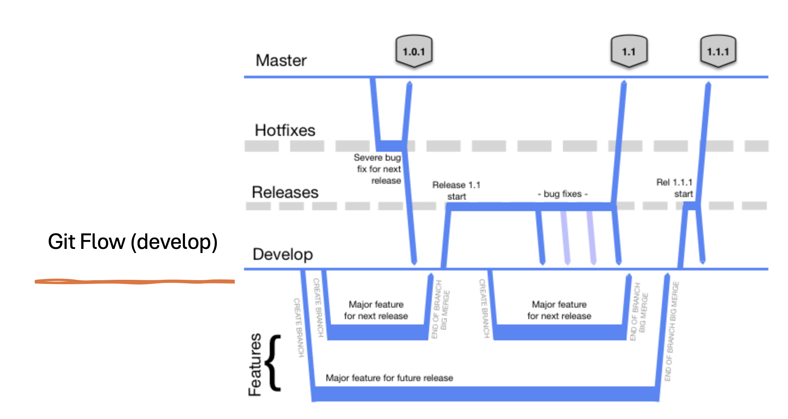

# Introduction 
TODO: Give a short introduction of your project. Let this section explain the objectives or the motivation behind this project. 

This repo is using Trunk Based Development as a main branching strategy. To find more please visit the main webpage: [trunkbaseddevelopment.com](https://trunkbaseddevelopment.com/)

# Things to Consider
* This repository should use GitFlow as a branching strategy.
* 
* If you won't call your branch as per agreed branching `standards`, the Azure pipeline won't start or may fail to deploy an image.

# Getting Started
TODO: Guide users through getting your code up and running on their own system. In this section you can talk about:
1.	Installation process:
    • To connect to feed from your local, please follow the steps specified here:
    [.npmrc config](https://defradev.visualstudio.com/DEFRA-EUX-MMO/_artifacts/feed/mmo-shared-reference-data/connect)
2.	Software dependencies
3.	Latest releases
4.	API references

# Build and Test
TODO: Describe and show how to build your code and run the tests. 

# Contribute
TODO: Explain how other users and developers can contribute to make your code better. 

If you want to learn more about creating good readme files then refer the following [guidelines](https://docs.microsoft.com/en-us/azure/devops/repos/git/create-a-readme?view=azure-devops). You can also seek inspiration from the below readme files:
- [ASP.NET Core](https://github.com/aspnet/Home)
- [Visual Studio Code](https://github.com/Microsoft/vscode)
- [Chakra Core](https://github.com/Microsoft/ChakraCore)